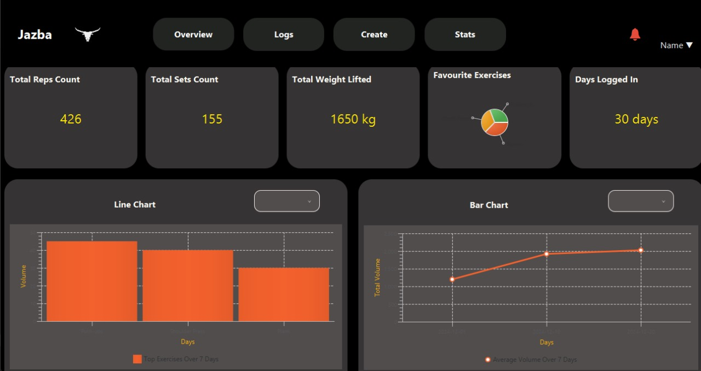
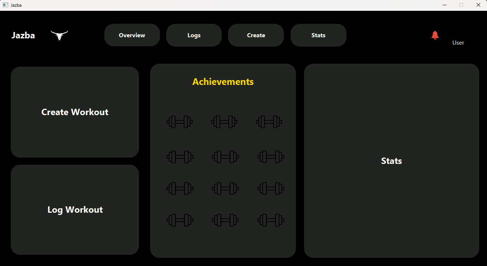

# Jazba

## Project Overview
"Jazba is a fitness tracking application designed to help users log workouts, set fitness goals, monitor progress, and receive personalized notifications. It features distinct admin and user roles, with functionalities such as exercise selection, workout logging, and achievement tracking. This project was developed as part of the Software Development and Analysis course, with contributions from [Taha, Sajid](https://github.com/TahaSAwan), Mian Abdullah, [Umer Sani](https://github.com/umersanii)."

## Project Structure

```
com.jazba
│
├── controller
│   ├── admin
│   │   ├── AdminBroadcastController.java
│   │   ├── AdminController.java
│   │   ├── AdminNotifyUserController.java
│   │   ├── ReportsController.java
│   │   ├── SystemLogsController.java
│   │   └── UserManagementController.java
│   ├── user
│   │   ├── CreateWorkoutController.java
│   │   ├── ExerciseSelectionController.java
│   │   ├── FeedbackController.java
│   │   ├── LogWorkoutController.java
│   │   ├── ProfilePopupController.java
│   │   ├── RegistrationController.java
│   │   ├── SettingsController.java
│   │   └── StatsPageController.java
│   ├── workout
│   │   ├── WorkoutExerciseController.java
│   │   └── WorkoutController.java
│   └── MainSceneController.java
│
├── dao
│   ├── achievement
│   │   └── AchievementDAO.java
│   ├── stats
│   │   ├── LogWorkoutDAO.java
│   │   └── StatsDAO.java
│   ├── user
│   │   ├── RegistrationDAO.java
│   │   └── UserDAO.java
│   └── workout
│       ├── WorkoutDAO.java
│       └── WorkoutPresetDAO.java
│
├── model
│   ├── achievement
│   │   ├── Achievement.java
│   │   └── Badge.java
│   ├── stats
│   │   ├── Stats.java
│   │   ├── Exercise.java
│   │   └── UserSession.java
│   ├── user
│   │   ├── User.java
│   │   ├── Membership.java
│   │   ├── Profile.java
│   │   └── Notification.java
│   ├── workout
│   │   ├── Workout.java
│   │   ├── WorkoutPreset.java
│   │   ├── WorkoutTemplate.java
│   │   └── ExerciseStats.java
│   └── SceneManager.java
│
├── util
│   ├── db
│   │   ├── DatabaseHelper.java
│   │   └── DB.java
│   └── helpers
│       ├── NotificationHelper.java
│       └── StatsHelper.java
│
├── view
│   ├── admin
│   │   ├── Admin.fxml
│   │   ├── AdminBroadcast.fxml
│   │   ├── AdminNotifyUser.fxml
│   │   ├── Reports.fxml
│   │   ├── SystemLogs.fxml
│   │   └── UserManagement.fxml
│   ├── user
│   │   ├── CreateWorkout.fxml
│   │   ├── ExerciseSelection.fxml
│   │   ├── Feedback.fxml
│   │   ├── LogWorkout.fxml
│   │   ├── ProfilePopup.fxml
│   │   ├── Registration.fxml
│   │   ├── Settings.fxml
│   │   └── StatsPage.fxml
│   ├── workout
│   │   ├── WorkoutExercise.fxml
│   │   └── Workout.fxml
│   └── MainScene.fxml
│
├── resources
│   ├── images
│   │   ├── dumbbell.png
│   │   ├── dumbbell2.png
│   │   └── other-assets...
│   └── styles
│       ├── main.css
│       └── themes...
│
└── Jazba.java
```

### **controller**
- Handles user interactions and coordinates between model and view layers.
- **admin**, **user**, **workout**, **MainSceneController.java**

### **dao**
- Responsible for database operations using DAOs (Data Access Objects).
- **achievement**, **stats**, **user**, **workout**

### **model**
- Contains core data models, including user data, stats, and workout routines.
- **achievement**, **stats**, **user**, **workout**

### **util**
- Utility classes to support the application, such as for database and notifications.
- **db**, **helpers**

### **view**
- Contains all FXML files for the user interface, divided into admin, user, and workout sections.

### **resources**
- Includes static assets like images and styles.

## Setup

### Prerequisites
- Java 8 or higher
- JavaFX
- Database setup (e.g., MySQL or SQLite)

### Screenshots

| **Stats GUI Screen** | **User Dashboard GUI Screen** |
|----------------------|-----------------------|
|  |  |

### Installation
1. Clone the repository:
   ```bash
   git clone https://github.com/umersanii/jazba.git
   ```
2. Build the project using your preferred IDE (e.g., IntelliJ IDEA or Eclipse) or command line.

3. Run the `Jazba.java` to start the application.

## Features

- **Admin Panel**: Broadcast messages, notify users, manage reports, system logs, and user management.
- **User Interface**: Create and log workouts, select exercises, view stats, provide feedback, and manage profile settings.
- **Workouts & Stats**: Track exercise performance, view progress, and earn achievements.

## Contribution
Feel free to fork this project and submit pull requests for improvements or bug fixes. Please ensure all tests pass before submitting a pull request.
